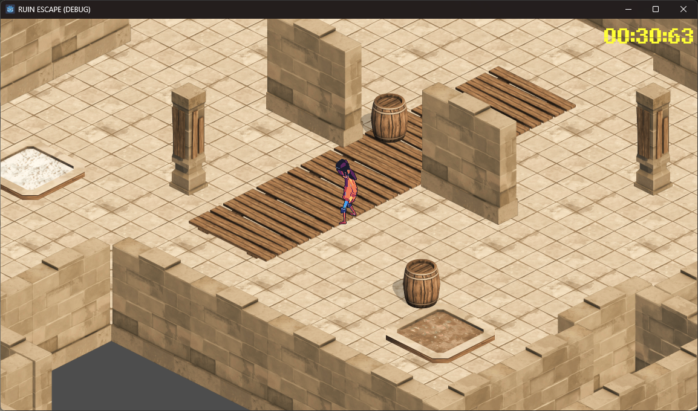
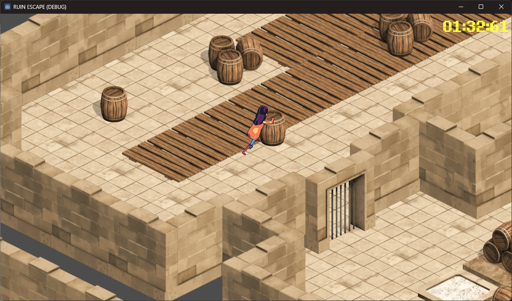
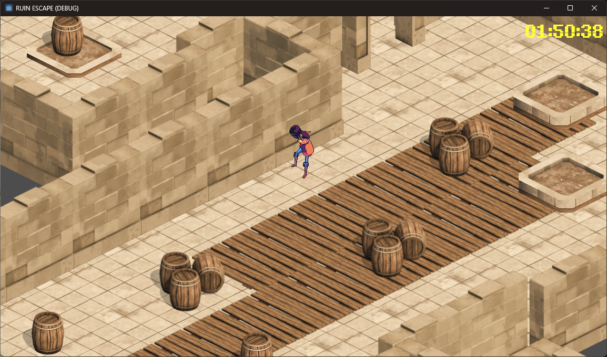

# Ruin-Escape

A 2D isometric puzzle adventure game where players explore ancient ruins, solve environmental puzzles, and escape by activating pressure plates to unlock the path forward.

## About the Game

Ruin Escape is a puzzle-based escape game focused on movement, problem-solving, and speed. Players must push barrels onto pressure plates to open doors while navigating through mysterious ruins. The goal is to complete each level and achieve the fastest escape time possible.

## Features

* Isometric puzzle gameplay
* Barrel pushing mechanics
* Pressure plate and door unlocking system
* Time-based escape challenge
* Simple exploration and problem-solving mechanics

## Objective

Find your way through the ruins by:

1. Exploring the environment
2. Moving barrels onto pressure plates
3. Unlocking blocked paths
4. Escaping in the shortest time possible

## Controls

| Key               | Action      |
| ----------------- | ----------- |
| WASD / Arrow Keys | Move Player |
| Space             | Jump        |
| Shift             | Sprint      |
| Q                 | Roll        |
| Shift + Space     | Sprint Jump |

## Built With

* Engine: Godot
* Language: GDScript
* Genre: Isometric Puzzle Adventure

## Screenshots

## How to Run

1. Download or clone this repository
2. Open the project using Godot Engine
3. Run the main scene

## 👤 Developer

Created by: Jhonric S, Baguisi

## Project Status

This project is a prototype created as a game development project.
